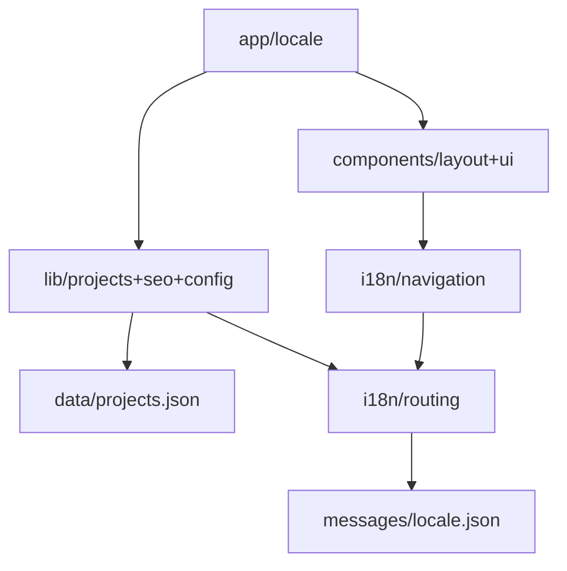

# Portfolio Hub — Architecture AS-IS

**Version:** 0.1.0 | **Date:** 2025-11-30

---

## 1. Overview

**Goal:** Internationalized portfolio (en/ru) showcasing projects with filtering and SEO optimization.

**Stack:** Next.js 16 App Router, React 19.2, TypeScript 5 (strict), Tailwind CSS 4, next-intl 4.4, Vitest 4, Playwright 1.56, pnpm, Node.js 20

**NFR Status:**

| Requirement     | Status     | Note                                                           |
| --------------- | ---------- | -------------------------------------------------------------- |
| Performance     | ⚠️ Partial | SSR/SSG enabled, no monitoring                                 |
| SEO             | ✅ Strong  | Metadata API, sitemap, robots, OG tags, alternates             |
| Maintainability | ✅ Good    | TypeScript strict, ESLint, Prettier, path aliases              |
| Scalability     | ⚠️ Limited | JSON storage: max ~50-100 projects                             |
| Accessibility   | ⚠️ Unknown | No ARIA audit, no automated a11y tests                         |
| Security        | ⚠️ Basic   | No CSP, X-Frame-Options headers                                |
| i18n            | ⚠️ Partial | Locales: en, ru (current), expandable; translations incomplete |
| Testability     | ⚠️ Partial | Vitest + Playwright configured, low coverage                   |

---

## 2. Layer Structure & Modules

**Layers:**

```
App (src/app) → Components (layout/, ui/) → Library (lib/) → i18n (src/i18n) → Data (JSON)
```

**App Layer** (`src/app/`)

- Routes, layouts, metadata, SSR/SSG with `[locale]` routing

**Components Layer** (`src/components/`)

- `layout/`: Header, Footer
- `ui/`: Button, Badge, Container, ProjectCard, Separator

**Library Layer** (`src/lib/`)

- `projects.ts`: CRUD, filtering
- `seo.ts`: Metadata generation
- `config.ts`: Site configuration
- `utils.ts`: Utilities

**i18n Layer** (`src/i18n/`)

- `routing.ts`: Locale config (en, ru)
- `navigation.ts`: Locale-aware Link, Router
- `request.ts`: Server config

**Data Layer**

- `data/projects.json`: Static project data
- `messages/en.json`, `messages/ru.json`: Translations

**Module Diagram:**



**Import Pattern:** `@/*` path aliases, no relative imports, no circular dependencies.

---

## 3. Data Flows

**Projects Page:**

```
Request → /[locale]/projects → getAllProjects() → data/projects.json → <ProjectCard> → HTML
```

**SEO Metadata:**

```
Page → generateMetadata() → buildLocaleMetadata() → getTranslations() + seoConfig → Metadata API
```

**i18n:**

```
Request → [locale] → i18n/request.ts → messages/{locale}.json → NextIntlClientProvider → useTranslations()
```

---

## 4. Implemented Decisions (ADR)

**ADR-0001: Next.js App Router**  
App Router for React Server Components, metadata API, streaming SSR, improved TypeScript support.

**ADR-0002: next-intl for i18n**  
next-intl for native App Router support, type-safe translations, locale-aware routing.

**ADR-0003: JSON Data Layer**  
Static JSON in `data/` for MVP simplicity, Git versioning, no external dependencies. Not scalable >50-100 projects. CMS migration possible when projects >20-30.

**ADR-0004: Tailwind CSS 4 + shadcn/ui**  
Utility-first styling with design tokens, shadcn/ui pattern for Radix UI primitives, dark mode support.

**ADR-0005: Path Aliases `@/*`**  
`@/*` for all imports from `src/` to avoid relative paths, improve refactoring, enhance readability.

---

## 5. Current State by Area

### i18n

**Infrastructure:** ✅ Complete

- next-intl 4.4, locales: en (default), ru (current), expandable
- Locale-based routing via `[locale]` dynamic segment
- Locale auto-detection disabled
- Locale-aware navigation (Link, useRouter, usePathname)

**Translation Coverage:** ❌ Incomplete

- ✅ Translated: `meta.*`, `nav.*`, `cta.*`, `common.*`
- ❌ Hardcoded: Page content, component labels

### SEO

**Implemented:** ✅

- Metadata API with dynamic titles
- Locale alternates (hreflang)
- Open Graph tags, Twitter Cards
- Canonical URLs, sitemap.xml, robots.ts

**Missing:** ⚠️

- JSON-LD structured data
- Web Vitals monitoring
- `/og.png`, `/favicon.ico`

### Data

**Storage:** Static JSON (`data/projects.json`)

- Typed schema: `src/types/project.ts`
- Single project entry

**API Functions:**

- `getAllProjects()`: Returns all projects
- `getProjects(filter?)`: Filter by status, featured, tags, tech, year
- `getProjectBySlug(slug)`: Single project lookup
- `getFeaturedProjects()`: Returns projects where `featured: true`
- `getAllTags()`: Extracts unique tags from all projects
- `getAllTechnologies()`: Extracts unique tech from all projects
- `getProjectYears()`: Extracts unique years, sorted descending

**Data State:**

- `featured`: ✅ Present (1 project with `featured: true`)
- `tags`: ✅ Present (4 tags: web-development, full-stack, testing, demo)
- `tech`: ✅ Present (array present)
- `year`: ✅ Present (2024)

**Validation:** ❌ No runtime validation (no Zod)

**Limitations:**

- Not scalable >100 projects
- Requires deployment for updates
- No CMS
- Derived collections (tags/years/featured) depend on project data completeness

### Testing

**Infrastructure:** ✅ Configured

- Vitest 4.0.3, Playwright 1.56.1, MSW 2.11.6, Testing Library

**Coverage:**

- Unit: projects, i18n (`lib/projects.test.ts`, `i18n/routing.test.ts`, `proxy.test.ts`)
- Component: Button only (`button.test.tsx`)
- E2E: minimal
- No coverage thresholds

### DevOps

**Code Quality:** ✅

- ESLint 9, Prettier 3.6.2, Husky 9.1.7, lint-staged

**CI/CD:** ❌ Not configured

**Deployment:** Vercel (no GitHub Actions)

**Environment:** ❌ No `.env.example`

**Monitoring:** ❌ No analytics, error tracking, performance monitoring

---

**Lines:** 200
